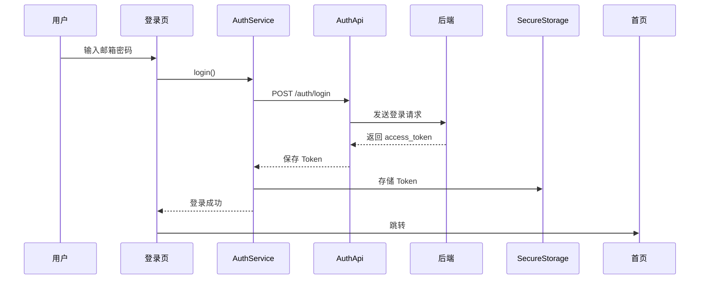

# 📱 WanderFlow 移动端开发完整指南

## 概述

本文档为 WanderFlow AI 旅行助手移动端开发的完整指南，包括技术选型、架构设计、开发流程等。

---

## 一、技术选型对比

### 1.1 跨平台方案对比

| 方案 | 学习曲线 | 性能 | 开发效率 | 生态 | 推荐度 |
|------|----------|------|----------|------|--------|
| Flutter | 中等 | ⭐⭐⭐⭐⭐ | ⭐⭐⭐⭐⭐ | ⭐⭐⭐⭐⭐ | ⭐⭐⭐⭐⭐ |
| React Native | 低 | ⭐⭐⭐⭐ | ⭐⭐⭐⭐ | ⭐⭐⭐⭐⭐ | ⭐⭐⭐⭐ |
| Ionic | 低 | ⭐⭐⭐ | ⭐⭐⭐⭐⭐ | ⭐⭐⭐ | ⭐⭐⭐ |
| 原生开发 | 高 | ⭐⭐⭐⭐⭐ | ⭐⭐ | ⭐⭐⭐⭐ | ⭐⭐ |

### 1.2 为什么选择 Flutter？

| 优势 | 说明 |
|------|------|
| **一套代码** | 同时支持 iOS 和 Android，节省 50% 开发时间 |
| **性能优秀** | 编译为原生代码，接近原生性能 |
| **开发效率** | 热重载，快速迭代 |
| **UI 漂亮** | 自带 Material Design，UI 一致性高 |
| **Google 支持** | 官方维护，长期有保障 |

---

## 二、项目架构

### 2.1 整体架构

```
┌─────────────────────────────────────┐
│          Flutter App                │
├─────────────────────────────────────┤
│  UI Layer (Screens + Components)    │
├─────────────────────────────────────┤
│  State Management (Riverpod)        │
├─────────────────────────────────────┤
│  Services (Auth, API, Storage)      │
├─────────────────────────────────────┤
│  Network Layer (Dio)                │
├─────────────────────────────────────┤
│  Backend API (FastAPI)              │
└─────────────────────────────────────┘
```

### 2.2 目录结构详解

```
lib/
├── main.dart                     # 应用入口
│
├── api/                          # API 接口层
│   ├── api_client.dart           # Dio HTTP 客户端
│   ├── endpoints.dart            # 所有接口路径定义
│   ├── auth_api.dart             # 认证 API 实现
│   ├── planner_api.dart          # 行程规划 API
│   ├── copywriter_api.dart       # 文案生成 API
│   └── qa_api.dart               # AI 对话 API
│
├── models/                       # 数据模型（与后端对应）
│   ├── user.dart                 # User
│   ├── user_quota.dart           # UserQuota
│   ├── itinerary.dart            # Itinerary, DayPlan, Activity
│   ├── copywriting_result.dart   # CopywritingResult
│   └── chat_message.dart         # ChatMessage
│
├── screens/                      # 页面
│   ├── auth/                     # 认证相关
│   │   ├── login_screen.dart     # 登录页
│   │   └── register_screen.dart  # 注册页
│   ├── home/                     # 首页（待实现）
│   ├── planner/                  # 行程规划（待实现）
│   ├── copywriter/               # 文案生成（待实现）
│   ├── chat/                     # AI 对话（待实现）
│   ├── profile/                  # 个人中心（待实现）
│   └── settings/                 # 设置（待实现）
│
├── components/                   # 可复用组件
│   ├── common/                   # 通用组件
│   │   ├── app_button.dart       # 按钮
│   │   ├── app_input.dart        # 输入框
│   │   └── app_card.dart         # 卡片
│   ├── auth/                     # 认证组件
│   ├── planner/                  # 行程组件
│   └── copywriter/               # 文案组件
│
├── services/                     # 业务服务
│   └── auth_service.dart         # 认证服务（状态管理）
│
├── theme/                        # 主题配置
│   ├── app_theme.dart            # 亮色/暗色主题
│   └── dimensions.dart           # 尺寸、间距
│
├── utils/                        # 工具类
│   ├── constant.dart             # 常量配置
│   ├── validators.dart           # 表单验证
│   └── toast.dart                # 提示消息
│
└── routes/                       # 路由配置
    └── app_router.dart           # GoRouter 配置
```

---

## 三、核心功能实现指南

### 3.1 认证流程



**代码实现**：`lib/services/auth_service.dart`

### 3.2 API 调用示例

```dart
// 1. 初始化 API 客户端
final ApiClient client = ApiClient();
client.init();

// 2. 调用接口
final PlannerApi plannerApi = PlannerApi();
final itineraries = await plannerApi.getItineraries();

// 3. 处理响应
for (var item in itineraries) {
  final itinerary = Itinerary.fromJson(item);
  print(itinerary.title);
}
```

### 3.3 状态管理

```dart
// 使用 Riverpod 管理状态
final itineraryProvider = FutureProvider.autoDispose((ref) async {
  final api = PlannerApi();
  final response = await api.getItineraries();
  return response;
});

// 在 Widget 中使用
class MyWidget extends ConsumerWidget {
  @override
  Widget build(BuildContext context, WidgetRef ref) {
    final itineraries = ref.watch(itineraryProvider);
    return itineraries.when(
      data: (data) => ListView.builder(...),
      loading: () => CircularProgressIndicator(),
      error: (e, s) => Text('错误: $e'),
    );
  }
}
```

---

## 四、开发时间线

### 阶段一：基础框架（第 1 周）

- [x] 项目搭建
- [x] API 客户端
- [x] 数据模型
- [x] 认证页面
- [ ] 首页框架

### 阶段二：核心功能（第 2-3 周）

- [ ] 行程规划功能
  - [ ] 行程列表
  - [ ] 行程详情
  - [ ] 生成行程表单
- [ ] 文案生成功能
  - [ ] 平台选择
  - [ ] 图片上传
  - [ ] 结果展示

### 阶段三：扩展功能（第 4 周）

- [ ] AI 对话
- [ ] 个人中心
- [ ] 设置页面

### 阶段四：优化测试（第 5 周）

- [ ] UI 优化
- [ ] 性能优化
- [ ] 多设备测试
- [ ] Bug 修复

---

## 五、发布上架

### 5.1 Android

```bash
# 1. 生成签名密钥
keytool -genkey -v -keystore ~/key.jks -keyalg RSA -keysize 2048 -validity 10000 -alias key

# 2. 配置 android/key.properties
flutter pub run
flutter build apk --release
```

### 5.2 iOS

```bash
# 1. 打开 Xcode
open ios/Runner.xcworkspace

# 2. 配置签名和证书

# 3. 构建
flutter build ios --release
```

---

## 六、成本估算

### 自主开发

| 项目 | 成本 |
|------|------|
| 开发者账号（Apple） | ¥688/年 |
| 开发者账号（Google） | $25 一次性 |
| 时间成本 | 4-5 周 |

### 外包开发

| 项目 | 费用 |
|------|------|
| 基础功能（登录、首页） | ¥8,000-12,000 |
| 核心功能（行程、文案） | ¥12,000-20,000 |
| 扩展功能（对话、个人中心） | ¥5,000-10,000 |
| 测试优化 | ¥3,000-5,000 |
| **总计** | **¥28,000-47,000** |

---

## 七、下一步行动

### 立即开始

1. **安装 Flutter SDK**
   ```bash
   # macOS
   brew install flutter

   # Windows
   # 从官网下载安装包
   # https://docs.flutter.dev/get-started/install/windows
   ```

2. **配置开发环境**
   ```bash
   flutter doctor
   flutter doctor --android-licenses
   ```

3. **运行项目**
   ```bash
   cd mobile/flutter
   flutter pub get
   flutter run
   ```

### 学习资源

- Flutter 官方文档：https://docs.flutter.dev/
- Flutter 中文网：https://flutter.cn/
- Dart 语言指南：https://dart.dev/guides
- Flutter 实战课程：https://www.bilibili.com/video/BV1uJ411d7yk

---

**开始开发吧！** 🚀
